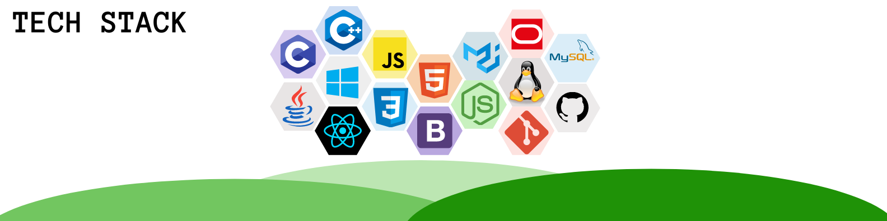

- 🔭 I’m currently persuing undergraduation in *Computer Science*.
- ⚡ I'm interested in _*Competitive Coding*_ and _*Web-Development*_.
- ❤️ Learning and Exploring _*React*_.
- 🥅 2021 Goals: Contribute to OPEN SOURCE!..

 

 

  ### CONNECT WITH ME AT:
  
   
  
  
  
   

 

 
 
 

  
   
 

  

 
 <a href="https://github.com/wadermanasi/github-readme-stats">
</a>
 

 

 

[website]: https://wadermanasi.github.io/portfolio/
[instagram]: https://www.instagram.com/wmanasi_art06/
[linkedin]: https://www.linkedin.com/in/manasi-wader-2455a0197/
[github]: https://github.com/WaderManasi/
[mail]: manasiwader@gmail.com
